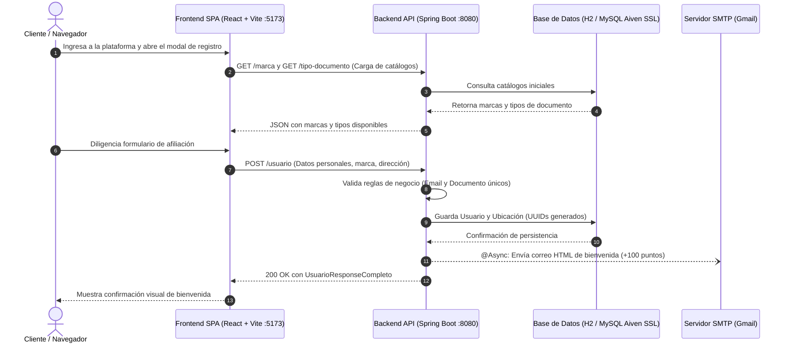
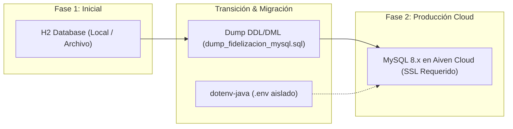

<div align="center">

# 🌟 Club de Fidelización & Recompensas Multi-Marca

> **Plataforma integral Full-Stack para la captación, registro y fidelización de clientes en marcas comerciales asociadas.**

[](https://openjdk.org/)
[](https://spring.io/projects/spring-boot)
[](https://react.dev/)
[](https://vitejs.dev/)
[](https://tailwindcss.com/)
[](https://www.mysql.com/)
[](https://aiven.io/)

---

### 🧭 Navegación entre Módulos
**[📖 README Principal](./README.md)** &nbsp;|&nbsp; **[⚛️ Documentación del Frontend (React)](./registromarca/README.md)** &nbsp;|&nbsp; **[☕ Documentación del Backend (Spring Boot)](./Registro_Marca/README.md)**

---

</div>

## 📑 Tabla de Contenidos

- [📌 Descripción del Proyecto](#-descripción-del-proyecto)
- [🧩 Arquitectura e Integración Full-Stack](#-arquitectura-e-integración-full-stack)
- [🚀 Características Principales](#-características-principales)
- [🔄 Evolución: Migración de H2 a MySQL](#-evolución-arquitectónica-migración-de-h2-a-mysql-en-aiven-cloud)
- [🛠️ Stack Tecnológico](#️-stack-tecnológico)
- [📂 Estructura del Repositorio](#-estructura-del-repositorio)
- [⚙️ Configuración e Instalación Local](#️-configuración-e-instalación-local)
  - [Prerrequisitos](#prerrequisitos)
  - [1. Clonar el Repositorio](#1-clonar-el-repositorio)
  - [2. Configuración y Montaje del Backend (`Registro_Marca`)](#2-configuración-y-montaje-del-backend-registro_marca)
  - [3. Configuración y Montaje del Frontend (`registromarca`)](#3-configuración-y-montaje-del-frontend-registromarca)
- [📡 Resumen de Endpoints (API REST)](#-resumen-de-endpoints-api-rest)
- [🧪 Pruebas y Control de Calidad](#-pruebas-y-control-de-calidad)
- [👨‍💻 Autor](#-autor)

---

## 📌 Descripción del Proyecto

**Club de Fidelización & Recompensas Multi-Marca** es una solución web integral diseñada para la captación, registro y fidelización de clientes en un ecosistema comercial multimarca (*Americanino, American Eagle, Chevignon, Esprit, Naf Naf, Rifle*). 

Permite la afiliación ágil e interactiva de usuarios mediante una experiencia moderna de usuario, asociándolos a su marca favorita, validando sus documentos de identidad, geolocalizando su residencia y otorgándoles de forma inmediata un **bono de bienvenida (+100 puntos)** con notificación automática por correo electrónico en formato HTML responsivo.

---

## 🧩 Arquitectura e Integración Full-Stack

El ecosistema opera mediante una arquitectura desacoplada conectada vía HTTP/REST:



---

## 🚀 Características Principales

- 👤 **Registro y Perfilado Dinámico**: Captura validada de información personal, residencia, tipo de documento de identidad y marca de preferencia.
- 🎁 **Sistema de Bienvenida Automatizado**: Despacho en segundo plano (`@Async`) de correos electrónicos corporativos en HTML responsivo acreditando un bono de +100 puntos sin demorar la respuesta de la API.
- 🏷️ **Ecosistema Multi-Marca Escalable**: Asociación de clientes a marcas reconocidas del catálogo (*Americanino, American Eagle, Chevignon, Esprit, Naf Naf, Rifle*).
- 🆔 **Seguridad e Integridad de Identificación**: Control estricto de unicidad en correos y documentos oficiales (Cédula de Ciudadanía, Cédula de Extranjería, Pasaporte, PEP, Tarjeta de Identidad) con llaves primarias basadas en `UUID`.
- 📍 **Gestión Eficiente de Ubicaciones**: Reutilización automática de entidades de ubicación para evitar duplicación de registros de domicilios.
- ☁️ **Evolución y Persistencia en la Nube**: El sistema comenzó operando sobre **H2 Database** y fue migrado con éxito a una base de datos gestionada en la nube de **MySQL (Aiven Cloud)** con conexión cifrada obligatoria por SSL (`sslMode=REQUIRED`).
- 🔐 **Seguridad de Credenciales**: Aislamiento de variables sensibles mediante archivos `.env` (vía `dotenv-java` en backend y variables `VITE_` en frontend), garantizando cero exposición de contraseñas en Git.

---

## 🔄 Evolución Arquitectónica: Migración de H2 a MySQL en Aiven Cloud

El proyecto inició su ciclo de vida y primeras etapas operando con **H2 Database** (modo persistente en archivo y consola web). Con el fin de escalar el sistema a un entorno de producción robusto, de alta disponibilidad y con soporte para múltiples instancias concurrentes, se planificó y ejecutó una **migración integral hacia una instancia administrada de MySQL en Aiven Cloud**:



### 🎯 Beneficios y Puntos Clave de la Migración:
1. **Persistencia Empresarial en la Nube:** Eliminación del riesgo de bloqueo por archivo local o pérdida de datos, delegando el almacenamiento en un clúster gestionado de Aiven.
2. **Cifrado en Tránsito:** Tráfico seguro garantizado mediante el flag `ssl-mode=REQUIRED`.
3. **Respaldo Estructurado:** Creación del archivo [`dump_fidelizacion_mysql.sql`](./Registro_Marca/dump_fidelizacion_mysql.sql) con la definición exacta de tablas, índices y datos precargados.
4. **Flexibilidad Continua:** La arquitectura mantiene soporte híbrido; el backend puede alternar a H2 para pruebas unitarias (`./mvnw test`) o desarrollo offline sin requerir conexión a Internet.

## 🛠️ Stack Tecnológico

### Backend ([Ver documentación dedicada](./Registro_Marca/README.md))
| Tecnología | Versión / Detalle | Propósito |
| :--- | :--- | :--- |
| **Java** | 21 (LTS OpenJDK) | Lenguaje base con sintaxis moderna (Records, Text Blocks) |
| **Spring Boot** | 4.1.1 | Framework central de la aplicación |
| **Spring Data JPA** | Hibernate 6 | Mapeo objeto-relacional y consultas optimizadas |
| **Spring Mail** | JavaMailSender | Integración con SMTP Gmail para envío de correos |
| **Spring Validation** | Jakarta Validation | Reglas y restricciones de integridad en DTOs |
| **SpringDoc OpenAPI** | Swagger UI 3 | Documentación interactiva y prueba en vivo de endpoints |
| **Lombok** | 1.18+ | Reducción de código repetitivo (Getters, Setters, Builders) |

### Frontend ([Ver documentación dedicada](./registromarca/README.md))
| Tecnología | Versión / Detalle | Propósito |
| :--- | :--- | :--- |
| **React** | 19.x | Biblioteca declarativa para interfaces de usuario reactivas |
| **Vite** | 6.x / 8.x | Herramienta de compilación y servidor de desarrollo ultra rápido |
| **Tailwind CSS** | 4.x | Framework de estilos utilitarios moderno y responsivo |
| **React Router DOM**| 7.x | Enrutamiento SPA con soporte de modal en ruta (`backgroundLocation`) |
| **Axios** | 1.x | Cliente HTTP con interceptores para consumo de la API REST |
| **Lucide React** | 1.x | Set de iconografía minimalista y moderna |

### Persistencia e Infraestructura
| Tecnología | Propósito |
| :--- | :--- |
| **MySQL 8.x (Aiven Cloud)** | Base de datos relacional gestionada en la nube con conexión segura SSL |
| **H2 Database** | Base de datos en memoria y persistente en disco para desarrollo local y pruebas |
| **Git & GitHub** | Control de versiones con flujo organizado de ramas |

---

## 📂 Estructura del Repositorio

```text
Fidelizacion/
│
├── README.md                                  # Documentación principal del repositorio
│
├── Registro_Marca/                            # BACKEND (Spring Boot 4 / Java 21)
│   ├── README.md                              # Documentación técnica del backend
│   ├── .env                                   # Credenciales de BD (ignorado en Git)
│   ├── .env.example                           # Plantilla de variables de entorno del backend
│   ├── data/                                  # Almacenamiento físico de BD H2 (modo archivo)
│   ├── src/
│   │   ├── main/
│   │   │   ├── java/com/Fidelizacion/Registro_Marca/
│   │   │   │   ├── RegistroMarcaApplication.java  # Clase principal con @EnableAsync
│   │   │   │   ├── configuracion/             # CORS, OpenAPI Swagger y Datos Iniciales
│   │   │   │   ├── controladores/             # Endpoints REST (Usuario, Marca, Ubicacion, etc.)
│   │   │   │   ├── DTOs/                      # Records inmutables para Request/Response
│   │   │   │   ├── exepciones/                # ValidacionExcepcion y manejo de errores
│   │   │   │   ├── modelos/                   # Entidades JPA (Usuario, Marca, TipoDoc, Ubicacion)
│   │   │   │   ├── repositorio/               # Interfaces Spring Data JPA
│   │   │   │   ├── servicios/                 # Lógica de negocio y servicio de correo asíncrono
│   │   │   │   ├── utils/                     # Enums de Roles (ADMIN, CLIENTE)
│   │   │   │   └── validaciones/              # Capa de validación de reglas de negocio
│   │   │   └── resources/
│   │   │       ├── application.properties     # Configuración de Spring y servidor SMTP
│   │   │       └── static/ / templates/
│   │   └── test/                              # Suite de 117+ pruebas unitarias y de integración
│   ├── dump_fidelizacion_mysql.sql            # Dump completo en dialecto nativo MySQL 8
│   ├── pom.xml                                # Dependencias y plugins de Maven
│   └── mvnw / mvnw.cmd                        # Wrapper de Maven para ejecución portable
│
└── registromarca/                             # FRONTEND (React 19 + Vite + Tailwind CSS)
    ├── README.md                              # Documentación técnica del frontend
    ├── .env                                   # Variables de entorno del cliente (VITE_...)
    ├── public/                                # Recursos estáticos y favicons
    ├── src/
    │   ├── assets/                            # Logos oficiales de marcas y fondos hero
    │   ├── components/                        # Componentes UI (Form, Header, Modales, Drawer)
    │   ├── layouts/                           # LayoutHeader con Header sticky y Outlet
    │   ├── pages/
    │   │   ├── HomePage.jsx                   # Landing page con propuesta de valor y catálogo
    │   │   └── RegistroPage.jsx               # Modal interactivo de afiliación con validaciones
    │   ├── routes/                            # Configuración de rutas y modal contextual
    │   ├── services/
    │   │   ├── apiBack.js                     # Instancia centralizada de Axios e interceptores
    │   │   ├── marcaService.js                # Consumo de endpoints de marcas aliadas
    │   │   ├── tipoDocumentoService.js        # Consumo de catálogo de tipos de documento
    │   │   ├── ubicacionService.js            # Integración geográfica en cascada
    │   │   └── usuarioService.js              # Envío y consulta de usuarios
    │   ├── App.jsx                            # Componente raíz
    │   ├── main.jsx                           # Punto de entrada en el DOM
    │   └── index.css                          # Directivas base de Tailwind CSS v4
    ├── index.html                             # Plantilla HTML base
    ├── package.json                           # Dependencias y scripts de Node.js
    └── vite.config.js                         # Configuración de Vite y plugins
```

---

## ⚙️ Configuración e Instalación Local

### Prerrequisitos
Antes de comenzar, asegúrate de tener instalado en tu sistema:
* **Java JDK 21** o superior: `java -version`
* **Node.js 18** o superior y **npm**: `node -v` y `npm -v`
* **Git**: `git --version`

---

### 1. Clonar el Repositorio

Abre una terminal y clona el proyecto:

```bash
git clone https://github.com/JuanZB360/Fidelizacion.git
cd Fidelizacion
```

---

### 2. Configuración y Montaje del Backend (`Registro_Marca`)

#### A. Configurar las Variables de Entorno
Ingresa a la carpeta del backend y crea tu archivo `.env`:

```bash
cd Registro_Marca
```

Crea el archivo `.env` para conectar a la base de datos MySQL (por ejemplo, Aiven Cloud con SSL):

```env
DB_URL=jdbc:mysql://<HOST_AIVEN>:<PUERTO>/<DATABASE>?ssl-mode=REQUIRED&serverTimezone=UTC&allowPublicKeyRetrieval=true
DB_USER=<TU_USUARIO>
DB_PASSWORD=<TU_CONTRASENA>
```

> [!TIP]
> **Modo Local H2:** Si prefieres no usar una base de datos remota, en [`src/main/resources/application.properties`](./Registro_Marca/src/main/resources/application.properties) puedes activar la base de datos H2 en memoria o archivo.

#### B. Configuración de Correo Electrónico (Gmail SMTP)
En `src/main/resources/application.properties`, define tus credenciales de Gmail. Recuerda utilizar una **Contraseña de Aplicación** de 16 caracteres generada desde tu cuenta de Google:

```properties
spring.mail.host=smtp.gmail.com
spring.mail.port=587
spring.mail.username=tu_correo@gmail.com
spring.mail.password=abcdefghijklmnop   # Contraseña de aplicación de 16 letras
```

#### C. Compilar y Ejecutar el Backend
```bash
# Compilar proyecto y descargar dependencias
./mvnw clean compile

# Iniciar la aplicación
./mvnw spring-boot:run
```

El servidor backend iniciará en:  
👉 **`http://localhost:8080`**

* **Documentación Interactiva Swagger UI:** [http://localhost:8080/swagger-ui/index.html](http://localhost:8080/swagger-ui/index.html)
* **Consola H2 (si está habilitada):** [http://localhost:8080/h2-console](http://localhost:8080/h2-console)

---

### 3. Configuración y Montaje del Frontend (`registromarca`)

Abre una **segunda terminal** en la raíz del repositorio:

```bash
cd Fidelizacion/registromarca
```

#### A. Configurar el archivo `.env`
Crea el archivo `.env` en `registromarca/` indicando la URL de la API de Spring Boot:

```env
# URL base hacia el backend Spring Boot
VITE_API_URL_Revueta_Back=http://localhost:8080/

# Tiempo de espera límite para peticiones (milisegundos)
VITE_TIMEOUT_PETICION=10000
```

#### B. Instalar Dependencias
```bash
npm install
```

#### C. Iniciar el Servidor de Desarrollo
```bash
npm run dev
```

La aplicación cliente iniciará de inmediato en:  
👉 **`http://localhost:5173`**

---

## 📡 Resumen de Endpoints (API REST)

| Módulo | Método | Endpoint | Descripción |
| :--- | :--- | :--- | :--- |
| **Usuarios** | `POST` | `/usuario` | Registra un usuario completo, asigna marca, domicilio y envía correo de bienvenida |
| **Usuarios** | `GET` | `/usuario/{id}` | Obtiene el detalle completo de un usuario por su UUID |
| **Usuarios** | `GET` | `/usuario` | Lista todos los usuarios registrados |
| **Usuarios** | `PATCH` | `/usuario/{id}` | Actualización parcial de datos de un usuario |
| **Marcas** | `POST` | `/marca` | Crea una nueva marca comercial |
| **Marcas** | `GET` | `/marca` | Lista todas las marcas disponibles |
| **Marcas** | `GET` | `/marca/{id}` | Obtiene información de una marca por ID |
| **Marcas** | `GET` | `/marca/{id}/usuarios` | Lista todos los clientes afiliados a una marca |
| **Tipos Doc.** | `POST` | `/tipo-documento` | Registra un nuevo tipo de identificación |
| **Tipos Doc.** | `GET` | `/tipo-documento` | Lista todos los tipos de documento oficiales |
| **Ubicaciones** | `POST` | `/ubicacion` | Registra una nueva dirección geográfica |
| **Ubicaciones** | `GET` | `/ubicacion` | Lista todas las direcciones almacenadas |

---

## 🧪 Pruebas y Control de Calidad

El backend cuenta con una suite integral de 117 pruebas automatizadas que cubren controladores, validaciones de negocio, repositorios y servicios:

```bash
cd Registro_Marca
./mvnw test
```

**Resultado:**
```text
[INFO] Tests run: 117, Failures: 0, Errors: 0, Skipped: 0
[INFO] BUILD SUCCESS
```

---

## 👨‍💻 Autor

Este proyecto fue diseñado, desarrollado e implementado por:

**Juan David Zapata Barrera**  
*Desarrollador de Software*  
GitHub: [@JuanZB360](https://github.com/JuanZB360)

---

<div align="center">

Club de Fidelización © 2026 - Todos los derechos reservados.

</div>
