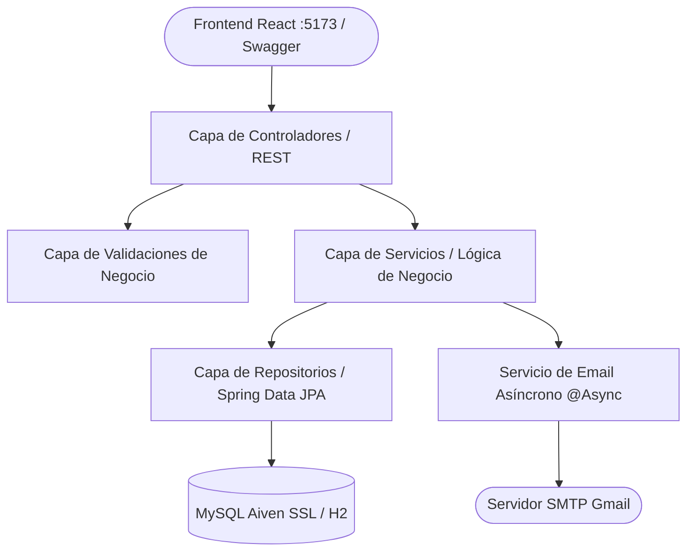

<div align="center">

# ☕ Backend API - Club de Fidelización & Recompensas Multi-Marca

> **API RESTful de alto rendimiento desarrollada con Spring Boot 4 y Java 21 para la gestión de usuarios, catálogos multimarca, geolocalización, persistencia en la nube y notificaciones asíncronas por correo electrónico.**

[](https://openjdk.org/)
[](https://spring.io/projects/spring-boot)
[](https://spring.io/projects/spring-data-jpa)
[](https://www.mysql.com/)
[](https://aiven.io/)
[](https://swagger.io/)

---

### 🧭 Navegación entre Módulos
**[⬅️ Volver al README Principal](../README.md)** &nbsp;|&nbsp; **[⚛️ Ver Documentación del Frontend (React)](../registromarca/README.md)**

---

</div>

## 📑 Tabla de Contenidos

- [📌 Descripción del Backend](#-descripción-del-backend)
- [🚀 Características Principales](#-características-principales)
- [🛠️ Stack Tecnológico](#️-stack-tecnológico)
- [🏛️ Arquitectura por Capas](#️-arquitectura-por-capas)
- [📂 Estructura de Directorios](#-estructura-de-directorios)
- [⚙️ Instalación y Configuración Local](#️-instalación-y-configuración-local)
  - [Prerrequisitos](#prerrequisitos)
  - [Configuración de Base de Datos (.env y H2)](#configuración-de-base-de-datos-env-y-h2)
  - [Configuración del Servicio de Correo (Gmail SMTP)](#configuración-del-servicio-de-correo-gmail-smtp)
  - [Compilación y Ejecución](#compilación-y-ejecución)
- [📡 Documentación Completa de Endpoints](#-documentación-completa-de-endpoints)
- [📖 Swagger / OpenAPI](#-swagger--openapi)
- [🛡️ Manejo Centralizado de Errores](#️-manejo-centralizado-de-errores)
- [🧪 Pruebas Unitarias y de Integración](#-pruebas-unitarias-y-de-integración)
- [👨‍💻 Autor](#-autor)

---

## 📌 Descripción del Backend

El backend de **Club de Fidelización** es el núcleo de lógica de negocio y persistencia de la solución. Provee servicios REST consumidos por el cliente SPA en React ([`registromarca`](../registromarca/README.md)), garantizando la integridad de datos, unicidad de identificación oficial, reutilización geográfica y el despacho automático de correos en segundo plano (`@Async`) acreditando incentivos de bienvenida (+100 puntos).

Está configurado con soporte **CORS universal** para permitir la comunicación fluida con clientes en `http://localhost:5173`.

---

## 🚀 Características Principales

* **Gestión Multimarca**: Mantenimiento del catálogo de marcas aliadas (*Americanino, American Eagle, Chevignon, Esprit, Naf Naf, Rifle*) y consulta de usuarios vinculados a cada una.
* **Control Estricto de Identificación**: Soporte de tipos de documento oficiales (CC, TI, CE, Pasaporte, PEP) con validación de no duplicidad.
* **Reutilización Inteligente de Domicilios**: Consulta previa y reutilización de entidades geográficas para evitar duplicidad de registros en la base de datos.
* **Envío Asíncrono de Correos Electrónicos (`@Async`)**: Despacho de correos corporativos en HTML responsivo acreditando el bono de bienvenida sin penalizar el tiempo de respuesta del endpoint.
* **Persistencia Versátil (H2 / MySQL en Aiven Cloud)**: Flexibilidad para operar en memoria/disco local con H2 o conectarse a una instancia gestionada de MySQL en la nube con cifrado SSL obligatorio.
* **Aislamiento de Credenciales**: Soporte de variables en archivo `.env` vía `dotenv-java` para prevenir fugas de contraseñas en Git.

---

## 🛠️ Stack Tecnológico

| Componente | Tecnología | Versión | Propósito |
| :--- | :--- | :--- | :--- |
| **Lenguaje** | Java OpenJDK | 21 (LTS) | Base del sistema (Records, Text Blocks, Pattern Matching) |
| **Framework** | Spring Boot | 4.1.1 | Arquitectura del servidor y gestión de dependencias |
| **Persistencia** | Spring Data JPA / Hibernate | 6.x | Mapeo objeto-relacional y consultas optimizadas |
| **Base de Datos** | MySQL / H2 | 8.x / 2.x | Almacenamiento transaccional con soporte SSL |
| **Servicio de Correo** | Spring Mail (JavaMailSender) | Starter | Envío de correos SMTP en hilos `@Async` |
| **Validaciones** | Jakarta Validation | 3.x | Reglas de integridad de negocio en DTOs |
| **Documentación** | SpringDoc OpenAPI | 3.0.0 | Generador interactivo de Swagger UI |
| **Utilidades** | Project Lombok | 1.18+ | Reducción de código repetitivo |
| **Pruebas** | JUnit 5, Mockito | Últimas | Cobertura de 117 pruebas automatizadas |

---

## 🏛️ Arquitectura por Capas



---

## 📂 Estructura de Directorios

```text
Registro_Marca/
├── .env                                       # Credenciales de BD privadas (ignorado en Git)
├── .env.example                               # Plantilla pública de variables de entorno
├── data/                                      # Archivo de base de datos H2 (si se usa modo disco)
├── src/
│   ├── main/
│   │   ├── java/com/Fidelizacion/Registro_Marca/
│   │   │   ├── RegistroMarcaApplication.java  # Clase principal con @EnableAsync
│   │   │   ├── configuracion/
│   │   │   │   ├── CorsConfig.java            # Permite peticiones desde el frontend (:5173)
│   │   │   │   ├── DatosInicialesConfig.java  # Carga automática de marcas y tipos de documento
│   │   │   │   └── OpenApiConfig.java         # Personalización de esquema Swagger
│   │   │   ├── controladores/
│   │   │   │   ├── MarcaControlador/          # Endpoints /marca
│   │   │   │   ├── TipoDocumentoControlador/  # Endpoints /tipo-documento
│   │   │   │   ├── UbicacionControlador/      # Endpoints /ubicacion
│   │   │   │   ├── UsuarioControlador/        # Endpoints /usuario
│   │   │   │   └── ExcepcionControlador/      # Global Exception Handler (@RestControllerAdvice)
│   │   │   ├── DTOs/                          # Records inmutables para peticiones y respuestas
│   │   │   ├── exepciones/                    # ValidacionExcepcion personalizada
│   │   │   ├── modelos/                       # Entidades JPA (Usuario, Marca, TipoDoc, Ubicacion)
│   │   │   ├── repositorio/                   # Interfaces JpaRepository
│   │   │   ├── servicios/                     # Implementaciones de lógica de negocio y email
│   │   │   ├── utils/                         # Enumeración de Roles (ADMIN, CLIENTE)
│   │   │   └── validaciones/                  # Validaciones de unicidad y reglas del negocio
│   │   └── resources/
│   │       ├── application.properties         # Configuración del servidor y SMTP
│   │       └── static/ / templates/
│   └── test/                                  # 117 pruebas unitarias y de integración
├── dump_fidelizacion_mysql.sql                # Dump de respaldo completo para MySQL 8
├── pom.xml                                    # Dependencias de Maven
└── mvnw / mvnw.cmd                            # Wrapper de Maven
```

---

## ⚙️ Instalación y Configuración Local

### Prerrequisitos
* **Java JDK 21** o superior
* Acceso a terminal con **Bash** (Linux/macOS) o **PowerShell** (Windows)

---

### Configuración y Evolución de la Base de Datos (H2 ➔ Aiven MySQL)

> [!NOTE]
> **Hito de Migración:** El backend comenzó operando en producción con **H2 Database** (modo persistente). Para dotar a la plataforma de escalabilidad real, persistencia permanente multi-nodo y alta disponibilidad, la base de datos fue migrada exitosamente a un clúster gestionado de **MySQL en Aiven Cloud**.

#### Opción 1: Entorno de Producción Cloud (MySQL en Aiven con SSL) - *Recomendado*
El proyecto utiliza `dotenv-java` para leer las credenciales del clúster de Aiven sin exponer contraseñas en Git. Configura tu archivo `.env` en la raíz de `Registro_Marca/`:

```env
DB_URL=jdbc:mysql://<HOST_AIVEN>:<PUERTO>/<DATABASE>?ssl-mode=REQUIRED&serverTimezone=UTC&allowPublicKeyRetrieval=true
DB_USER=<USUARIO>
DB_PASSWORD=<CONTRASENA>
```

> **Restauración / Esquema:** El archivo [`dump_fidelizacion_mysql.sql`](./dump_fidelizacion_mysql.sql) contiene el esquema completo DDL e inserts DML utilizados en la migración.

#### Opción 2: Modo Local / Desarrollo (H2 Database)
Si deseas ejecutar el backend de manera local o sin conexión a la nube, en `src/main/resources/application.properties` puedes alternar a H2:
```properties
spring.datasource.url=jdbc:h2:mem:fidelizaciondb;DB_CLOSE_DELAY=-1;DB_CLOSE_ON_EXIT=TRUE
spring.datasource.driverClassName=org.h2.Driver
spring.datasource.username=sa
spring.datasource.password=
spring.jpa.database-platform=org.hibernate.dialect.H2Dialect
spring.jpa.hibernate.ddl-auto=create-drop
```
*(También se soporta modo archivo con `jdbc:h2:file:./data/fidelizaciondb`).*

---

### Configuración del Servicio de Correo (Gmail SMTP)

En `src/main/resources/application.properties`, configura tus credenciales SMTP:

```properties
spring.mail.host=smtp.gmail.com
spring.mail.port=587
spring.mail.username=fidelizacionmarca@gmail.com
spring.mail.password=TU_CONTRASENA_DE_APLICACION_AQUI
spring.mail.properties.mail.smtp.auth=true
spring.mail.properties.mail.smtp.starttls.enable=true
spring.mail.properties.mail.smtp.starttls.required=true
```

> [!IMPORTANT]
> **Contraseña de Aplicación de 16 caracteres:** Google no admite contraseñas normales para conexiones SMTP. Debes generar un código de 16 letras desde *Google Account > Seguridad > Contraseñas de aplicaciones*.

---

### Compilación y Ejecución

```bash
# Compilar proyecto y descargar dependencias
./mvnw clean compile

# Iniciar servidor backend
./mvnw spring-boot:run
```

El servicio estará disponible en: 👉 **`http://localhost:8080`**

---

## 📡 Documentación Completa de Endpoints

### 1. Usuarios (`/usuario`)
* `POST /usuario`: Registra un usuario, vincula marca, dirección y despacha email de bienvenida.
* `GET /usuario/{id}`: Detalle de usuario por UUID.
* `GET /usuario`: Lista completa de usuarios.
* `PATCH /usuario/{id}`: Actualización parcial de información.

#### Ejemplo de Petición (`POST /usuario`):
```json
{
  "nombre": "Carlos",
  "apellido": "Pérez",
  "email": "carlos.perez@example.com",
  "contrasena": "ClaveSegura123!",
  "rol": "CLIENTE",
  "tipoDocumento": { "id": "04500e1b-e69b-4cd5-ac21-a30043ea300a" },
  "numeroDocumento": "1098765432",
  "fechaNacimiento": "1998-05-20",
  "direccion": {
    "direccion": "Carrera 15 # 85-30",
    "ciudad": "Bogotá",
    "departamento": "Cundinamarca",
    "pais": "Colombia"
  },
  "marca": { "id": "3d5d9230-69bd-4d1f-aef9-626a31ea1ea2" }
}
```

### 2. Marcas (`/marca`)
* `POST /marca`: Crea una nueva marca.
* `GET /marca`: Lista todas las marcas.
* `GET /marca/{id}`: Consulta por UUID.
* `PATCH /marca/{id}`: Actualiza nombre de marca.
* `GET /marca/{id}/usuarios`: Lista clientes afiliados a la marca.

### 3. Tipos de Documento (`/tipo-documento`)
* `POST /tipo-documento`: Crea un tipo de documento.
* `GET /tipo-documento`: Lista tipos disponibles.
* `GET /tipo-documento/{id}`: Consulta por UUID.
* `PATCH /tipo-documento/{id}`: Actualiza nombre o abreviatura.
* `GET /tipo-documento/{id}/usuarios`: Usuarios vinculados al tipo de documento.

### 4. Ubicaciones (`/ubicacion`)
* `POST /ubicacion`: Registra una nueva ubicación.
* `GET /ubicacion`: Lista todas las ubicaciones.
* `GET /ubicacion/{id}`: Consulta por UUID.
* `PATCH /ubicacion/{id}`: Actualiza dirección.
* `GET /ubicacion/{id}/usuarios`: Usuarios residentes en la ubicación.

---

## 📖 Swagger / OpenAPI

La API cuenta con documentación interactiva viva:
* **Swagger UI:** [http://localhost:8080/swagger-ui/index.html](http://localhost:8080/swagger-ui/index.html)
* **Especificación OpenAPI (JSON):** [http://localhost:8080/v3/api-docs](http://localhost:8080/v3/api-docs)

---

## 🛡️ Manejo Centralizado de Errores

Cualquier excepción de validación o conflicto de unicidad responde con el esquema unificado `ErrorResponseDTO`:

```json
{
  "codigo": 400,
  "estado": "Bad Request",
  "mensaje": "Se encontraron errores de validación",
  "campo": "email",
  "errores": {
    "email": "El correo ya se encuentra registrado",
    "numeroDocumento": "El número de documento debe contener solo dígitos"
  },
  "timestamp": "2026-09-07T20:30:00"
}
```

---

## 🧪 Pruebas Unitarias y de Integración

Ejecución de la suite completa de pruebas:

```bash
./mvnw test
```

```text
[INFO] Tests run: 117, Failures: 0, Errors: 0, Skipped: 0
[INFO] BUILD SUCCESS
```

---

## 👨‍💻 Autor

Este proyecto fue diseñado, desarrollado e implementado por:

**Juan David Zapata Barrera**  
*Desarrollador de Software*  
GitHub: [@JuanZB360](https://github.com/JuanZB360)

---

<div align="center">

Club de Fidelización © 2026 - Todos los derechos reservados.

</div>
