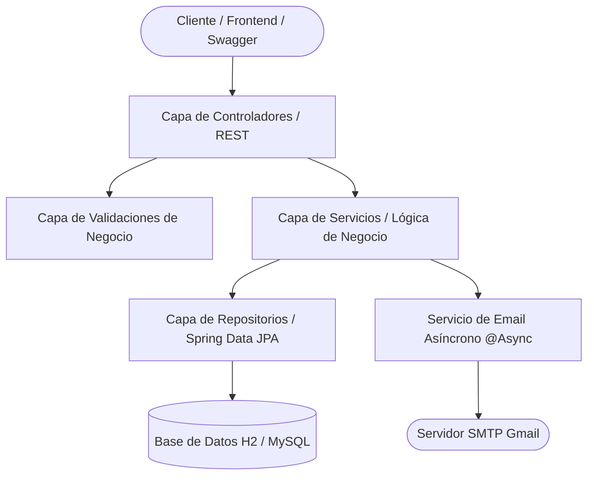

# 🏆 API de Registro y Fidelización de Marcas

API RESTful desarrollada con **Spring Boot 4** y **Java 21** para la administración integral de programas de fidelización comercial multimarca. Permite el registro y gestión de usuarios, asignación a marcas asociadas, georreferenciación de domicilios, validación de documentos de identidad y envío automatizado y asíncrono de correos electrónicos de bienvenida con incentivos de puntos.

---

## 📑 Tabla de Contenidos

- [Características Principales](#-características-principales)
- [Stack Tecnológico](#-stack-tecnológico)
- [Arquitectura del Proyecto](#-arquitectura-del-proyecto)
- [Estructura de Directorios](#-estructura-de-directorios)
- [Instalación y Configuración](#-instalación-y-configuración)
- [Configuración de Base de Datos y Consola H2](#-configuración-de-base-de-datos-y-consola-h2)
- [Configuración del Servicio de Correo (Gmail SMTP)](#-configuración-del-servicio-de-correo-gmail-smtp)
- [Documentación de la API (Endpoints)](#-documentación-de-la-api-endpoints)
  - [Usuarios (`/usuario`)](#1-usuarios-usuario)
  - [Marcas (`/marca`)](#2-marcas-marca)
  - [Tipos de Documento (`/tipo-documento`)](#3-tipos-de-documento-tipo-documento)
  - [Ubicaciones (`/ubicacion`)](#4-ubicaciones-ubicacion)
- [Swagger / OpenAPI](#-swagger--openapi)
- [Manejo Centralizado de Errores](#-manejo-centralizado-de-errores)
- [Ejecución de Pruebas](#-ejecución-de-pruebas)

---

## 🚀 Características Principales

* **Gestión Multimarca**: Registro y consulta de marcas afiliadas al programa (ej. Americanino, Chevignon, Rifle, etc.) y consulta de los clientes asociados a cada una.
* **Control de Identificación Oficial**: Soporte para múltiples tipos de documentos (CC, TI, CE, Pasaporte, PEP) con validación estricta de unicidad y formato.
* **Gestión Inteligente de Ubicaciones**: Reutilización automática de entidades de ubicación geográfica evitando duplicidades innecesarias en la base de datos.
* **Notificaciones Asíncronas por Correo (`@Async`)**: Despacho en segundo plano de correos HTML con diseño responsivo al registrar un cliente, acreditando su bono de bienvenida (+100 puntos) sin bloquear el hilo de la solicitud HTTP.
* **Datos Semilla Automáticos**: Precarga automática de tipos de documento y marcas reconocidas al inicializar la aplicación.
* **Validaciones Robustas y Manejo Global de Errores**: Filtro transversal de excepciones con respuestas estandarizadas en formato JSON estructurado.
* **Soporte CORS Universal**: Configurado para integrarse sin bloqueos con frontends en React, Vue, Angular o clientes móviles.

---

## 🛠️ Stack Tecnológico

| Componente | Tecnología | Versión |
| :--- | :--- | :--- |
| **Lenguaje** | Java OpenJDK | 21 (LTS) |
| **Framework** | Spring Boot | 4.1.1 |
| **Persistencia** | Spring Data JPA / Hibernate | Incluido en Starter |
| **Base de Datos Principal** | H2 Database (modo archivo persistente) | 2.x |
| **Base de Datos Alternativa** | MySQL Connector/J (preconfigurado) | 9.x |
| **Documentación Interactiva** | SpringDoc OpenAPI / Swagger UI | 3.0.0 |
| **Servicio de Mensajería** | Spring Boot Starter Mail (JavaMailSender) | Incluido en Starter |
| **Procesamiento Asíncrono** | Spring Task Execution (`@EnableAsync`) | Incluido |
| **Reducción de Boilerplate** | Project Lombok | Última estable |
| **Testing** | JUnit 5, Mockito, Spring Boot Test | 117+ pruebas unitarias y de integración |

---

## 🏛️ Arquitectura del Proyecto

El proyecto sigue una arquitectura por capas desacoplada y orientada al dominio:



---

## 📂 Estructura de Directorios

```text
Registro_Marca/
├── data/                                # Archivo físico de la base de datos H2
├── src/
│   ├── main/
│   │   ├── java/com/Fidelizacion/Registro_Marca/
│   │   │   ├── RegistroMarcaApplication.java  # Clase principal con @EnableAsync
│   │   │   ├── configuracion/                 # Configs de CORS, OpenAPI y Carga de Datos
│   │   │   ├── controladores/                 # Endpoints REST (Usuario, Marca, Ubicacion, etc.)
│   │   │   ├── DTOs/                          # Records para Requests y Responses
│   │   │   ├── exepciones/                    # Excepciones personalizadas del dominio
│   │   │   ├── modelos/                       # Entidades JPA (Usuario, Marca, Ubicacion, etc.)
│   │   │   ├── repositorio/                   # Interfaces JPA (Spring Data)
│   │   │   ├── servicios/                     # Interfaces e implementaciones de negocio
│   │   │   ├── utils/                         # Enums (Roles) y utilitarios
│   │   │   └── validaciones/                  # Validaciones de reglas de negocio
│   │   └── resources/
│   │       └── application.properties         # Configuración del entorno de ejecución
│   └── test/                                  # Suite de pruebas unitarias y de integración
├── pom.xml                                    # Dependencias de Maven
└── mvnw / mvnw.cmd                            # Maven Wrapper
```

---

## ⚙️ Instalación y Configuración

### 1. Prerrequisitos
* **Java Development Kit (JDK)** versión 21 o superior instalado.
* Conexión a Internet (para la descarga inicial de librerías mediante Maven).

### 2. Clonar o acceder al proyecto
```bash
cd "/home/juandzaba/Escritorio/trabajo de enrega/Fidelizacion/Registro_Marca"
```

### 3. Compilar el proyecto
```bash
./mvnw clean compile
```

### 4. Ejecutar la aplicación
```bash
./mvnw spring-boot:run
```
La aplicación iniciará en `http://localhost:8080`.

---

## 🗄️ Configuración de Base de Datos y Consola H2

Por defecto, la aplicación utiliza una base de datos **H2 persistida en disco** en la ruta local `./data/fidelizaciondb.mv.db`, garantizando que la información se conserve al reiniciar el servidor.

### Parámetros en `application.properties`:
```properties
spring.datasource.url=jdbc:h2:file:./data/fidelizaciondb;AUTO_SERVER=TRUE;DB_CLOSE_DELAY=-1
spring.datasource.driverClassName=org.h2.Driver
spring.datasource.username=sa
spring.datasource.password=
spring.jpa.hibernate.ddl-auto=update
```

### Acceso a la consola web interactiva:
1. Abre tu navegador en: [http://localhost:8080/h2-console](http://localhost:8080/h2-console)
2. Ingresa los siguientes datos en el formulario de inicio de sesión:
   * **Driver Class:** `org.h2.Driver`
   * **JDBC URL:** `jdbc:h2:file:./data/fidelizaciondb`
   * **User Name:** `sa`
   * **Password:** *(dejar vacío)*
3. Haz clic en **Connect**.

> [!NOTE]
> Al iniciar la aplicación por primera vez en perfil normal (`!test`), [`DatosInicialesConfig`](file:///home/juandzaba/Escritorio/trabajo%20de%20enrega/Fidelizacion/Registro_Marca/src/main/java/com/Fidelizacion/Registro_Marca/configuracion/DatosInicialesConfig.java) precarga automáticamente:
> * **Tipos de documento:** Cédula de Ciudadanía (CC), Tarjeta de Identidad (TI), Cédula de Extranjería (CE), Pasaporte (PAS) y Permiso Especial de Permanencia (PEP).
> * **Marcas comerciales:** Americanino, American Eagle, Chevignon, Esprit, Naf Naf y Rifle.

---

## 📧 Configuración del Servicio de Correo (Gmail SMTP)

El servicio [`ImpEmailServicio`](file:///home/juandzaba/Escritorio/trabajo%20de%20enrega/Fidelizacion/Registro_Marca/src/main/java/com/Fidelizacion/Registro_Marca/servicios/emailServicio/ImpEmailServicio.java) envía correos HTML con el diseño corporativo de bienvenida cada vez que se registra un usuario.

### Configuración requerida en `src/main/resources/application.properties`:
```properties
spring.mail.host=smtp.gmail.com
spring.mail.port=587
spring.mail.username=fidelizacionmarca@gmail.com
spring.mail.password=TU_CONTRASENA_DE_APLICACION_AQUI
spring.mail.properties.mail.smtp.auth=true
spring.mail.properties.mail.smtp.starttls.enable=true
spring.mail.properties.mail.smtp.starttls.required=true
```

> [!IMPORTANT]
> **Generar la Contraseña de Aplicación de Google:**
> Gmail no admite contraseñas estándar para conexiones SMTP. Debes:
> 1. Activar la **Verificación en 2 pasos** en tu cuenta de Google.
> 2. Ir a la sección **Seguridad > Contraseñas de aplicaciones**.
> 3. Crear una contraseña para la aplicación (te entregará un código de 16 caracteres).
> 4. Copiar ese código en la propiedad `spring.mail.password`.

---

## 📡 Documentación de la API (Endpoints)

Base URL: `http://localhost:8080`

### 1. Usuarios (`/usuario`)

| Método | Endpoint | Descripción | Respuesta Exitosa |
| :--- | :--- | :--- | :--- |
| `POST` | `/usuario` | Registra un usuario completo, asocia su marca y dirección, y dispara el correo de bienvenida | `200 OK` |
| `GET` | `/usuario/{id}` | Consulta el detalle completo de un usuario por su UUID | `200 OK` |
| `GET` | `/usuario` | Lista todos los usuarios registrados | `200 OK` |
| `PATCH` | `/usuario/{id}` | Actualización parcial de información de un usuario | `200 OK` |

#### Ejemplo de Petición para Crear Usuario (`POST /usuario`):
```json
{
  "nombre": "Carlos",
  "apellido": "Pérez",
  "email": "carlos.perez@example.com",
  "contrasena": "ClaveSegura123!",
  "rol": "CLIENTE",
  "tipoDocumento": {
    "id": "e304b50c-e2f4-42ea-a4e9-6ecfa9d4df28"
  },
  "numeroDocumento": "1098765432",
  "fechaNacimiento": "1998-05-20",
  "direccion": {
    "direccion": "Carrera 15 # 85-30",
    "ciudad": "Bogotá",
    "departamento": "Cundinamarca",
    "pais": "Colombia"
  },
  "marca": {
    "id": "a1b2c3d4-e5f6-7890-abcd-1234567890ab"
  }
}
```

---

### 2. Marcas (`/marca`)

| Método | Endpoint | Descripción | Respuesta Exitosa |
| :--- | :--- | :--- | :--- |
| `POST` | `/marca` | Crea una nueva marca comercial | `200 OK` |
| `GET` | `/marca` | Lista todas las marcas disponibles | `200 OK` |
| `GET` | `/marca/{id}` | Obtiene una marca por su UUID | `200 OK` |
| `PATCH` | `/marca/{id}` | Actualiza el nombre de una marca | `200 OK` |
| `GET` | `/marca/{id}/usuarios` | Lista todos los usuarios suscritos a dicha marca | `200 OK` |

#### Ejemplo de Creación (`POST /marca`):
```json
{
  "nombre": "Levi's"
}
```

---

### 3. Tipos de Documento (`/tipo-documento`)

| Método | Endpoint | Descripción | Respuesta Exitosa |
| :--- | :--- | :--- | :--- |
| `POST` | `/tipo-documento` | Crea un nuevo tipo de identificación | `200 OK` |
| `GET` | `/tipo-documento` | Lista todos los tipos de documento | `200 OK` |
| `GET` | `/tipo-documento/{id}` | Obtiene un tipo de documento por ID | `200 OK` |
| `PATCH` | `/tipo-documento/{id}` | Actualiza nombre o abreviatura | `200 OK` |
| `GET` | `/tipo-documento/{id}/usuarios`| Lista usuarios que poseen este tipo de documento | `200 OK` |

#### Ejemplo de Creación (`POST /tipo-documento`):
```json
{
  "nombre": "Registro Civil",
  "abreviatura": "RC"
}
```

---

### 4. Ubicaciones (`/ubicacion`)

| Método | Endpoint | Descripción | Respuesta Exitosa |
| :--- | :--- | :--- | :--- |
| `POST` | `/ubicacion` | Registra una nueva dirección geográfica | `200 OK` |
| `GET` | `/ubicacion` | Lista todas las direcciones almacenadas | `200 OK` |
| `GET` | `/ubicacion/{id}` | Consulta una dirección por su UUID | `200 OK` |
| `PATCH` | `/ubicacion/{id}` | Actualiza datos de la dirección | `200 OK` |
| `GET` | `/ubicacion/{id}/usuarios` | Lista los usuarios asociados a esa dirección | `200 OK` |

---

## 📖 Swagger / OpenAPI

La API cuenta con documentación viva generada mediante SpringDoc OpenAPI 3:

* **Swagger UI interactivo:** [http://localhost:8080/swagger-ui/index.html](http://localhost:8080/swagger-ui/index.html)
* **Especificación OpenAPI (JSON):** [http://localhost:8080/v3/api-docs](http://localhost:8080/v3/api-docs)

Permite probar todos los endpoints directamente desde el navegador, inspeccionando los esquemas DTO y respuestas esperadas.

---

## 🛡️ Manejo Centralizado de Errores

Cualquier error de validación o excepción de negocio es capturada por [`ControladorExcepciones`](file:///home/juandzaba/Escritorio/trabajo%20de%20enrega/Fidelizacion/Registro_Marca/src/main/java/com/Fidelizacion/Registro_Marca/controladores/ExcepcionControlador/ControladorExcepciones.java), respondiendo con el formato estandarizado `ErrorResponseDTO`:

```json
{
  "codigo": 400,
  "estado": "Bad Request",
  "mensaje": "Se encontraron errores de validación",
  "campo": "email",
  "errores": {
    "email": "El correo ya se encuentra registrado",
    "numeroDocumento": "El número de documento debe contener solo dígitos"
  },
  "timestamp": "2026-09-07T20:30:00"
}
```

---

## 🧪 Ejecución de Pruebas

El proyecto cuenta con una cobertura integral de pruebas unitarias y de integración que validan controladores, servicios, repositorios y reglas de negocio:

```bash
# Ejecutar toda la suite de pruebas
./mvnw test

# Ejecutar una clase de prueba específica
./mvnw test -Dtest=UsuarioServicioTest
```

**Resultado de las pruebas:**
```text
[INFO] Tests run: 117, Failures: 0, Errors: 0, Skipped: 0
[INFO] BUILD SUCCESS
```
Todas las **117 pruebas automatizadas** se ejecutan y pasan satisfactoriamente.

